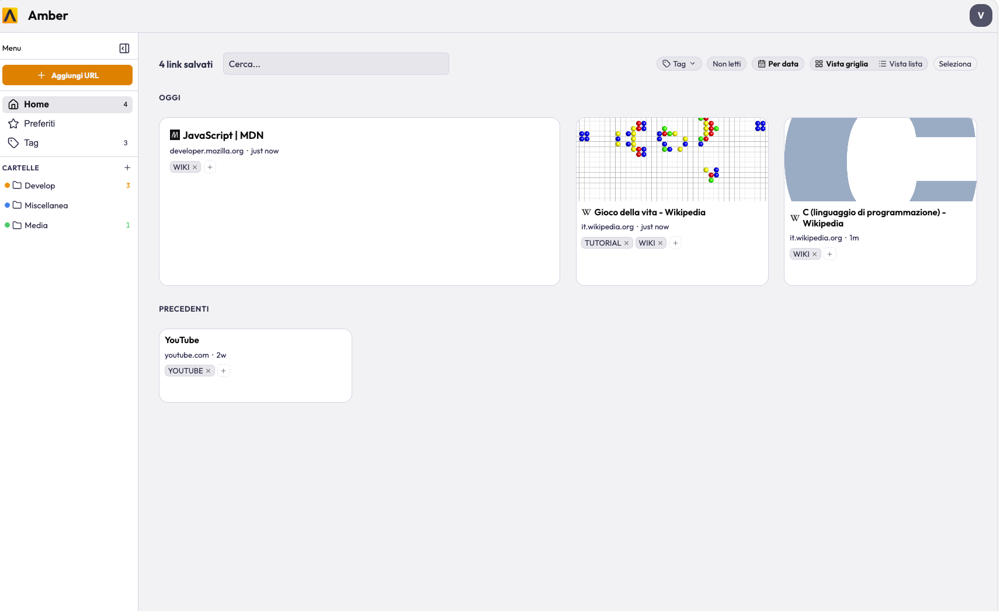
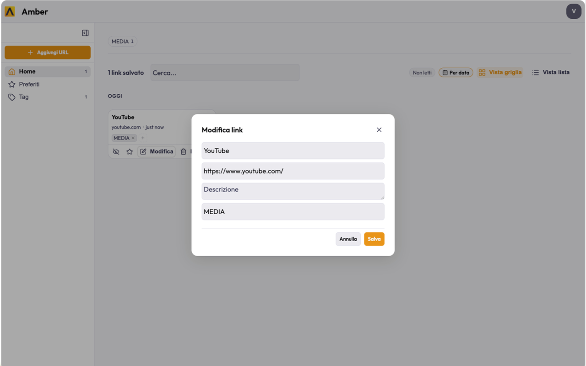
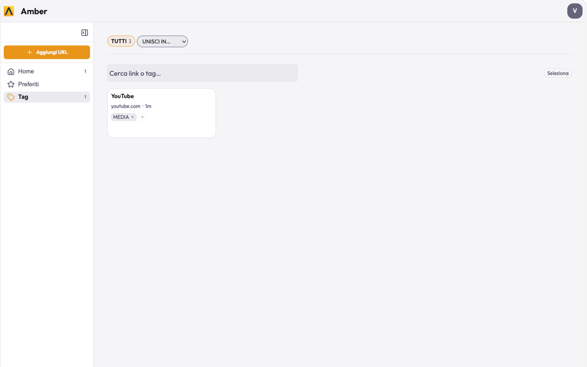

<h1>
Amber</h1>

Amber is a cross-platform link-saving app. Capture URLs in under 3 seconds from any device, organize them with tags and collections, and find them in under 5. A personal read-later tool with real-time cloud sync and offline support — built as an antidote to the browser bookmarks graveyard.

> Built entirely via vibe coding.



---

## Platforms

| Client | Description | Stack |
|---|---|---|
| **Amber for Chrome** | Browser extension — save from any page, browse on new tab, side panel | React 19, Vite, Firebase, SCSS |
| **Amber for Mobile** | iOS & Android app — capture and recall links on the go | Flutter/Dart, Firebase, SQLite |
| **Amber for Obsidian** | Obsidian plugin — manage saved links inside your vault | TypeScript, esbuild, Firebase, SCSS |

---

## Features

### Saving

- **One-click save** — save the current tab instantly from the browser extension popup or toolbar
- **Side panel** — persistent Chrome side panel (Chrome 116+) lets you browse and save without leaving the current page
- **Save overlay** — content script shows a confirmation toast on every save with title and duplicate detection
- **Custom URL** — manually add any URL and title from the popup
- **Mobile share sheet** — share any URL from any app on iOS/Android directly into Amber
- **Duplicate detection** — warns if the same URL is already saved, across all save paths
- **Swipe to edit (Mobile)** — swipe left on any link in the mobile app to reveal edit and delete actions

### Organization

- **Collections** — organize links into folders (collections); support nested sub-folders for hierarchical organization
- **Collection colors** — assign a custom color to each collection from a predefined palette; color shown as a dot in the sidebar and on collection items
- **Bulk assign** — select multiple links and assign them to a collection in one action
- **Tags** — attach up to 10 tags per link; stored and displayed uppercase
- **Favorites** — star links for a dedicated Favorites view
- **Read / Unread** — mark links as read to track your reading progress; filter by unread

### Notes

- **Personal notes** — free-text note field per link (`metadata.note`) for your own annotations — why you saved it, what you found, reading notes
- **Description field** — manually edit the description of any link for your own reference

### Search & Browse

- **Full-text search** — searches across title, URL, description, and page text in real time
- **Tag filtering** — filter the link list by one or more tags simultaneously
- **Tag management** — rename, merge, and delete tags globally from the Tags view
- **Favorites view** — dedicated view for starred links
- **Sort options** — sort by newest, oldest, title A–Z, or domain
- **Collection filtering** — browse and filter links by collection

### Import & Export

- **Import HTML bookmarks** — parse any Netscape Bookmark File (Chrome, Firefox, Safari exports); folders become tags; bulk-saves with duplicate detection
- **Export JSON** — export your full library as a structured JSON file (`{ version, app, exportedAt, count, links[] }`) with all metadata fields including notes and thumbnails

### Sync & Storage

- **Cloud sync** — Firebase Auth (email/password or Google sign-in) + Firestore with real-time `onSnapshot` listener
- **Offline / local fallback** — links stored locally when logged out (IndexedDB in browser, SQLite on mobile, JSON file in Obsidian); synced automatically on login
- **Migration on login** — local links migrate to Firestore on sign-in, local storage is cleared

### Thumbnails

- **Viewport screenshots** — browser extension captures a JPEG screenshot of the current tab viewport on save and stores it as the link thumbnail
- **OG image fallback** — if no screenshot, uses the page's `og:image` meta tag as thumbnail
- **Firebase Storage** — thumbnails uploaded to Firebase Storage (URL stored in Firestore); local base64 fallback when signed out
- **Mobile thumbnails** — mobile app displays left-aligned thumbnails (OG image or favicon) on every link card

### Keyboard Shortcuts (Browser)

| Shortcut | Action |
|---|---|
| `/` | Focus search |
| `n` | New link (add manually) |
| `e` | Edit focused link |
| `f` | Toggle favorite on focused link |
| `r` | Toggle read on focused link |
| `Delete` / `Backspace` | Delete focused link |
| `Escape` | Close modal / clear search |

### Header Links (Browser)

- Pin any URL to the new tab page header bar for one-click access; managed from the extension popup

---

## Screenshots

| Home | Edit link | Tags |
|---|---|---|
|  |  |  |

---

## Installation

### Chrome Extension

**Requirements:** Chrome 116+ (or any Chromium-based browser with side panel support), Node.js ≥ 22

**Option A — Load from source (development)**

```bash
# 1. Clone the repository
git clone https://github.com/your-username/amber-link-manager.git
cd amber-link-manager/browser

# 2. Set up environment variables
cp .env.example .env
# Edit .env and fill in your Firebase project config

# 3. Install dependencies
npm install

# 4. Build
npm run build
# Output is in dist/
```

Then in Chrome:
1. Go to `chrome://extensions/`
2. Enable **Developer mode** (top right toggle)
3. Click **Load unpacked**
4. Select the `browser/dist/` folder

The extension is now active. Click the amber icon in the toolbar to open the popup.

**Option B — Production zip**

After `npm run build`, a `amber-chrome-extension.zip` is created in the repo root. You can load it as an unpacked extension by unzipping first, or distribute it for sideloading.

---

### Mobile App (Flutter)

**Requirements:** Flutter 3.x, Dart 3.x, Android SDK / Xcode (for iOS)

```bash
cd amber-link-manager/flutter

# 1. Set up environment variables
cp env.example.json env.json
# Edit env.json and fill in your Firebase config

# 2. Install dependencies
flutter pub get

# 3. Run on a connected device or emulator
flutter run --dart-define-from-file=env.json

# 4. Build release APK (Android)
flutter build apk --dart-define-from-file=env.json

# 5. Build for iOS
flutter build ios --dart-define-from-file=env.json
```

> **Note:** Building Android requires Java 17+. Install with `brew install openjdk@17` and set `JAVA_HOME` before building.

The app registers as a share-sheet target on both platforms — share any URL from any app to add it directly to Amber.

---

### Obsidian Plugin

**Requirements:** Node.js ≥ 16, an Obsidian vault

```bash
cd amber-link-manager/obsidian

# 1. Set up environment variables
cp .env.example .env
# Edit .env and fill in your Firebase config

# 2. Install dependencies
npm install

# 3. Build
npm run build
# Output: main.js + styles.css
```

**Install into Obsidian:**

1. Copy `main.js`, `manifest.json`, and `styles.css` into your vault's `.obsidian/plugins/amber/` folder (create the folder if needed)
2. In Obsidian → Settings → Community plugins → enable **Amber**

Or, for development with live reload:

```bash
npm run dev
# Watches for changes and rebuilds automatically
```

---

## Firebase Setup

All clients connect to the same Firebase project. To use your own:

1. Create a project at [console.firebase.google.com](https://console.firebase.google.com)
2. Enable **Authentication** — add Email/Password and Google providers
3. Enable **Firestore Database** in Native mode
4. Enable **Firebase Storage** (for link thumbnails in the browser extension)
5. Copy your Firebase config into the appropriate env file:

| Client | File | Format |
|---|---|---|
| `browser/` | `.env` | `VITE_FIREBASE_API_KEY=…` |
| `flutter/` | `env.json` | `{ "FIREBASE_API_KEY": "…" }` |
| `obsidian/` | `.env` | `FIREBASE_API_KEY=…` |

6. Deploy Firestore security rules so each user can only read/write their own data:

```
rules_version = '2';
service cloud.firestore {
  match /databases/{database}/documents {
    match /users/{uid}/{document=**} {
      allow read, write: if request.auth != null && request.auth.uid == uid;
    }
  }
}
```

7. Deploy Storage security rules for thumbnails:

```
rules_version = '2';
service firebase.storage {
  match /b/{bucket}/o {
    match /users/{uid}/thumbnails/{imageId} {
      allow read, write: if request.auth != null && request.auth.uid == uid;
    }
  }
}
```

> The `.env` and `env.json` files are git-ignored. Never commit your real Firebase config.

No backend code to deploy — Firebase handles auth, storage, and sync entirely.

---

## Data Model

Every link is stored at `/users/{uid}/links/{linkId}` in Firestore with this shape:

```json
{
  "id": "uuid-v4",
  "url": "https://example.com",
  "title": "Page title",
  "savedAt": 1718000000000,
  "metadata": {
    "tags": ["DESIGN", "TOOLS"],
    "collectionId": "optional-collection-id",
    "description": "Manual description",
    "note": "Personal annotation",
    "isFavorite": false,
    "isRead": false,
    "thumbnail": "https://storage.googleapis.com/…",
    "favicon": "https://…/favicon.ico",
    "pageText": "First 5000 chars of page body"
  }
}
```

---

## Repository Structure

```
amber-link-manager/
├── browser/          # Chrome extension (React 19, Vite, MV3)
│   ├── src/
│   │   ├── background/   # Service worker
│   │   ├── content/      # Content script + save overlay
│   │   ├── popup/        # Toolbar popup SPA
│   │   ├── newtab/       # New tab page SPA
│   │   ├── sidepanel/    # Side panel SPA
│   │   ├── options/      # Settings page SPA
│   │   └── components/   # Shared UI components
│   └── dist/             # Build output (load unpacked from here)
├── flutter/          # iOS + Android app
│   └── lib/
│       ├── screens/      # App screens
│       ├── widgets/      # Reusable widgets
│       ├── providers/    # State management (Provider)
│       └── services/     # Firebase, SQLite, metadata fetching
├── obsidian/         # Obsidian plugin
│   └── src/
│       ├── main.ts       # Plugin entry point
│       └── components/   # UI components
├── docs/
│   └── ROADMAP.md        # Feature roadmap and competitive analysis
├── DESIGN.md             # Void v2 design system token reference
└── PRODUCT.md            # Product purpose, brand, design principles
```

---

## License

[MIT](./LICENSE.md)
